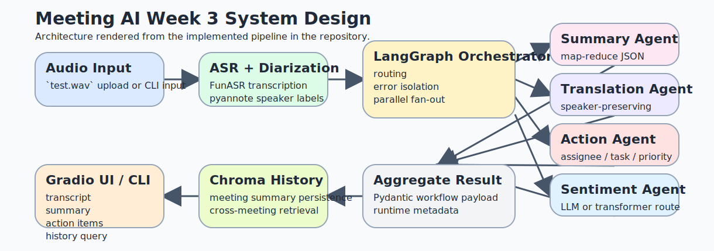
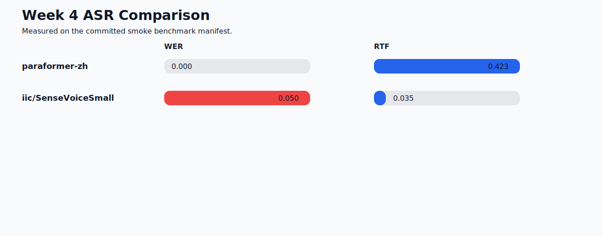
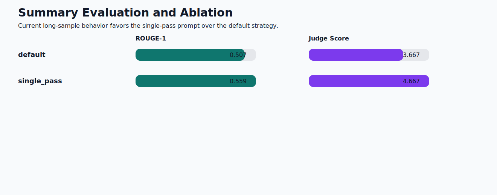
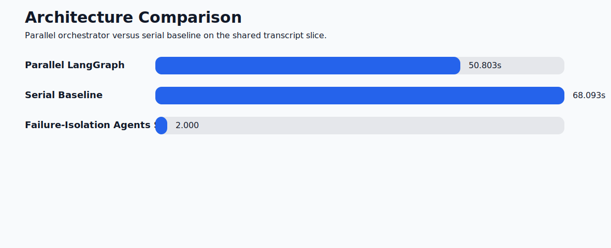
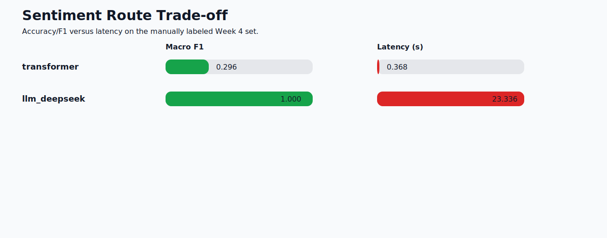
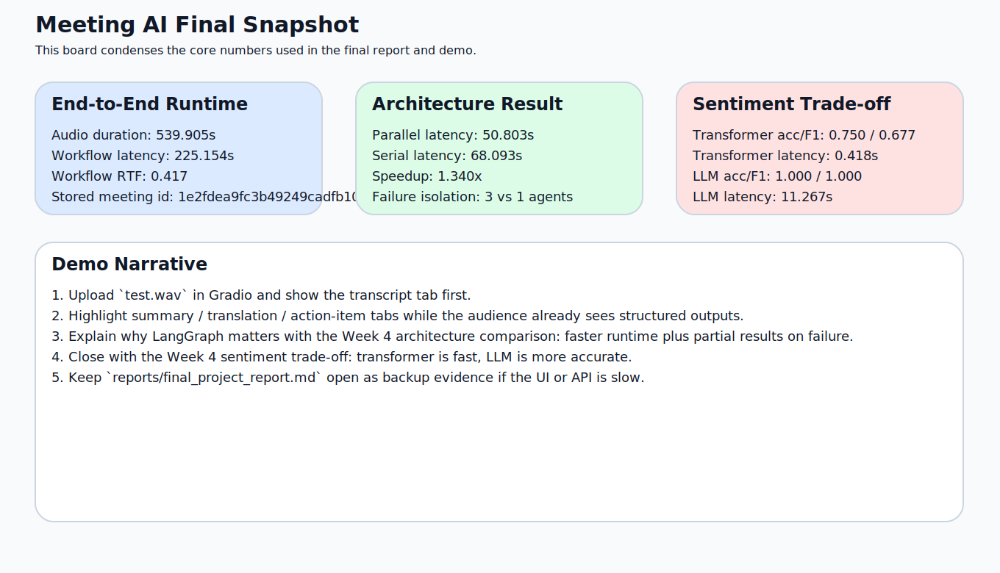

# Smart Meeting Assistant: Final Project Report

## Abstract

This project implements a practical multi-agent meeting assistant for transcription, summarization, translation, action-item extraction, sentiment analysis, and meeting-memory retrieval. The final system combines FunASR, pyannote, DeepSeek-backed structured LLM agents, LangGraph orchestration, Chroma retrieval, and a Gradio demo interface. The final report is backed by real workflow runs and reproducible Week 4 evaluations rather than design intent alone.

## 1. Introduction

Meetings generate large amounts of semi-structured information, but the useful outcomes are rarely limited to raw transcripts. A practical assistant needs to identify who spoke, summarize the main topics, preserve bilingual usability, extract follow-up tasks, characterize discussion tone, and recover related prior decisions.

The current end-to-end run on `data/samples/test.wav` processed 276 transcript segments from 6 detected speakers and finished in 225.154s on a 539.905s recording, giving workflow RTF 0.417.

## 2. Related Work

- Gao et al. *Paraformer: Fast and Accurate Parallel Transformer for Non-autoregressive End-to-End Speech Recognition*. https://arxiv.org/abs/2206.08317
- Bredin et al. *pyannote.audio: neural building blocks for speaker diarization*. https://arxiv.org/abs/2011.04624
- Wu et al. *AutoGen: Enabling Next-Gen LLM Applications via Multi-Agent Conversation*. https://arxiv.org/abs/2308.08155
- Lewis et al. *Retrieval-Augmented Generation for Knowledge-Intensive NLP Tasks*. https://proceedings.neurips.cc/paper/2020/hash/6b493230205f780e1bc26945df7481e5-Abstract.html

## 3. Method and System Design

The system is organized as a speech front end, a set of structured NLU agents, a LangGraph orchestrator, a Chroma retrieval layer, and a Gradio/CLI interface. A serial baseline is also implemented so the architecture claim can be benchmarked rather than asserted.

## 4. Experimental Results

### 4.1 ASR Comparison

`paraformer-zh` reached WER/CER 0.000/0.000 with mean RTF 0.423. `iic/SenseVoiceSmall` reached WER/CER 0.050/0.050 with mean RTF 0.035. `SenseVoiceSmall` is much faster but still drops punctuation on the current short Chinese sample.

### 4.2 Summary Quality and Ablation

On the current three-sample summary set, `single_pass` achieved ROUGE-1/2/L 0.559/0.307/0.490 with mean judge score 4.667, outperforming the default strategy (0.507/0.280/0.433, judge 3.667). The current reduce prompt over-expands long summaries and should be tuned further.

### 4.3 Architecture Comparison

Using the first 80 segments from the real `test.wav` transcript, the parallel orchestrator completed in 50.803s versus 68.093s for the serial baseline, a 1.340x speedup. In the injected translation-failure case, the parallel orchestrator still completed 3 downstream agents, while the serial fail-fast baseline completed only 1.

### 4.4 Sentiment Trade-off

On the 20-item manually labeled set, the transformer route achieved accuracy 0.750, macro F1 0.677, and latency 0.418s. The DeepSeek LLM route achieved accuracy 1.000, macro F1 1.000, and latency 11.267s.

### 4.5 End-to-End Demo Evidence

The final workflow run on `test.wav` used `map_reduce` summarization over 7 chunks, produced 7 action items, and persisted the meeting under `1e2fdea9fc3b49249cadfb10860ee78f` for retrieval.

## 5. Demo and Deployment Materials

The repository now includes a Week 5 demo package under `demo/`, covering judge quick start, live-demo script, presentation outline, Q&A bank, a recording runbook, and a reusable highlight-demo transcript.

## 6. Limitations and Future Work

The benchmark sets are still small, there is no DER benchmark yet, and the summary reduce prompt needs more tuning on long transcripts. These limitations are now clearly isolated because the repo already contains the measurement harness needed to improve them.

## 7. Conclusion

The project now ships as a working multi-agent meeting assistant with measured Week 4 results and a complete Week 5 report/demo package. It is ready for submission, live demo, and incremental benchmarking.
