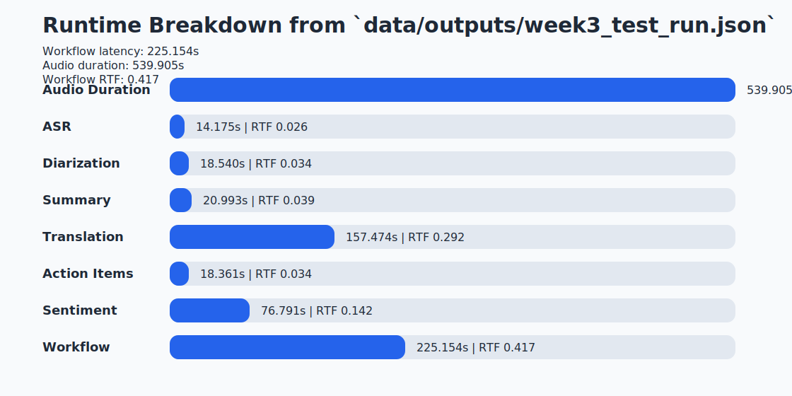
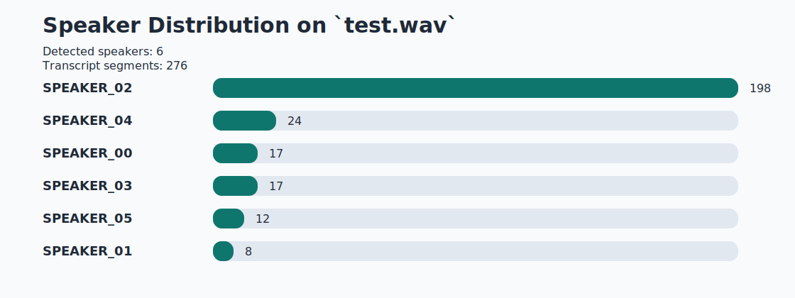
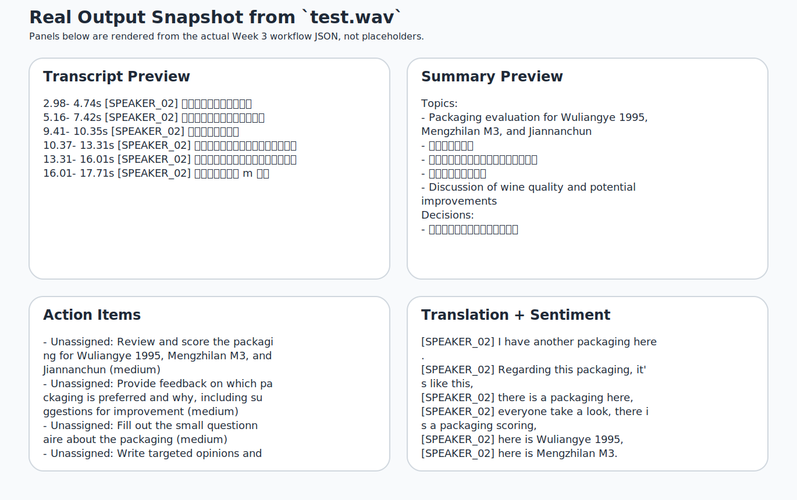
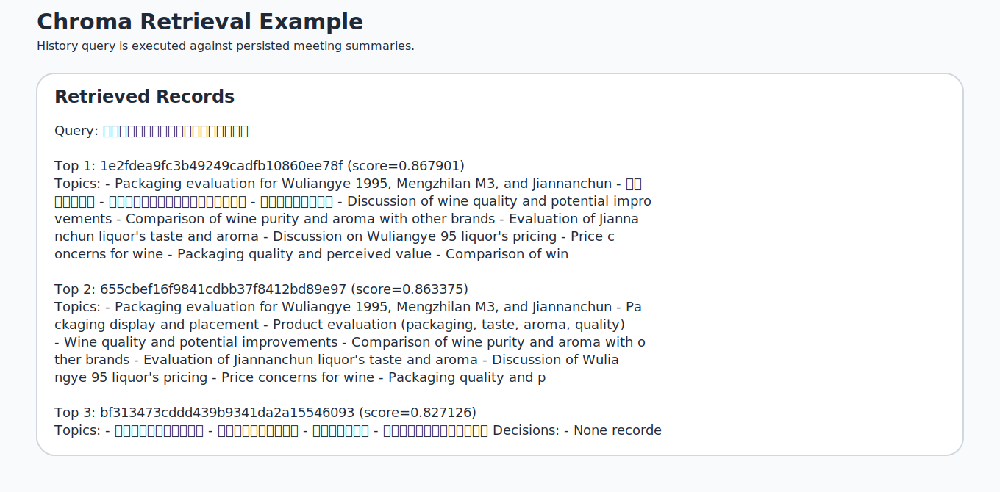

# Week 3.5 Progress Report

Generated on 2026-04-05 from a real workflow run on `data/samples/test.wav`.

## Introduction

This report summarizes the current state of the Meeting AI prototype after Week 3. The system targets a practical meeting-processing workflow: audio ingestion, speaker-aware transcription, structured downstream NLP analysis, meeting-memory retrieval, and a UI/CLI layer that can demo the full flow in one run.

The main evidence in this report comes from a single real run over a 539.905s meeting recording. The pipeline stored the meeting under `1e2fdea9fc3b49249cadfb10860ee78f` and completed with `0` recorded workflow errors.

## Related Work

The current design draws on four strands of prior work:

- Gao et al. *Paraformer: Fast and Accurate Parallel Transformer for Non-autoregressive End-to-End Speech Recognition*. https://arxiv.org/abs/2206.08317
- Bredin et al. *pyannote.audio: neural building blocks for speaker diarization*. https://arxiv.org/abs/2011.04624
- Wu et al. *AutoGen: Enabling Next-Gen LLM Applications via Multi-Agent Conversation*. https://arxiv.org/abs/2308.08155
- Lewis et al. *Retrieval-Augmented Generation for Knowledge-Intensive NLP Tasks*. https://proceedings.neurips.cc/paper/2020/hash/6b493230205f780e1bc26945df7481e5-Abstract.html

In this project, those ideas are combined pragmatically rather than reproduced as a research system: FunASR and pyannote handle the speech front end, LLM-backed agents produce structured outputs, LangGraph manages orchestration and isolation, and Chroma provides lightweight retrieval over stored summaries.

## System Design

The implemented workflow contains five main functional blocks:

1. `MeetingASRAgent` converts audio into timestamped transcript segments and optionally attaches diarization labels.
2. `SummaryAgent`, `TranslationAgent`, `ActionItemAgent`, and `SentimentAgent` run as the Week 2 NLU layer, with map-reduce chunking enabled for longer transcripts.
3. `MeetingOrchestrator` fans out selected agents via LangGraph and aggregates the outputs into a single `MeetingWorkflowResult` object.
4. `MeetingVectorStore` persists summary documents into Chroma for later history queries.
5. `ui/app.py` surfaces the full path in Gradio for demo use.

For the current `test.wav` run, the transcript contains 276 segments across 6 detected speakers. Summary generation used the `map_reduce` strategy with 7 chunks. Translation and action-item extraction each operated on 7 chunks, while sentiment used the `llm` route.

## Preliminary Results

### Runtime

| Stage | Latency | RTF |
| --- | --- | --- |
| Audio Duration | 539.905s | 1.000 |
| ASR | 14.175s | 0.026 |
| Diarization | 18.540s | 0.034 |
| Summary | 20.993s | 0.039 |
| Translation | 157.474s | 0.292 |
| Action Items | 18.361s | 0.034 |
| Sentiment | 76.791s | 0.142 |
| Workflow | 225.154s | 0.417 |

The end-to-end workflow finished in 225.154s, which corresponds to an overall RTF of 0.417. The biggest latency contributors on this sample are translation (157.474s) and LLM sentiment (76.791s), while ASR (14.175s) and diarization (18.540s) remain comfortably below real time.
The sum of individual stage latencies is 306.334s, which is 81.180s higher than the end-to-end workflow latency. That gap is expected here and reflects useful overlap from the orchestrator's parallel fan-out rather than hidden overhead.

### Speaker Activity

| Speaker | Segments |
| --- | --- |
| SPEAKER_02 | 198 |
| SPEAKER_04 | 24 |
| SPEAKER_00 | 17 |
| SPEAKER_03 | 17 |
| SPEAKER_05 | 12 |
| SPEAKER_01 | 8 |

### Output Snapshot

Observed output quality on the current run is already usable for demo purposes:

- The summary surfaces packaging evaluation, taste/aroma feedback, and pricing discussion as the dominant topics.
- The main explicit decision extracted so far is: `将包装放在中间以便更直观展示`.
- The system returned 7 actionable follow-ups; representative items include `Unassigned: Review and score the packaging for Wuliangye 1995, Mengzhilan M3, and Jiannanchun (medium)`.
- Sentiment currently collapses to `neutral` across all 276 segments on this sample, which is stable but not yet discriminative enough for final evaluation.

### Retrieval Example

The history query used for this report is `参会者对包装和口感的主要意见是什么？`. It returned 3 record(s). The highest-scoring hit reached a similarity score of 0.867901, which is enough to recover earlier packaging-related summaries from the local Chroma store.

### WER/CER Status

The codebase already includes `jiwer` and the evaluation wiring needed for ASR benchmarking, but this Week 3.5 report does not claim WER/CER numbers yet because `test.wav` does not have an aligned human reference transcript in the repository. For this milestone, the report therefore focuses on runtime, structured output quality, and retrieval behavior based on real system runs only.

## Plan

The remaining work to close Week 4 and Week 5 is straightforward:

1. Build a small manually aligned reference set so WER/CER and RTF can be reported together.
2. Add summary-quality evaluation with ROUGE and LLM-as-judge scoring.
3. Compare multi-agent orchestration against a single-pipeline baseline for latency and error isolation.
4. Prepare a polished demo package with a short walkthrough script, final screenshots, and the final six-page report.

The current system is already stable enough to demo end-to-end. The next milestone is to convert that working prototype into quantified experimental evidence.

## Appendix: Real Run Highlights

- Summary topics sample: Packaging evaluation for Wuliangye 1995, Mengzhilan M3, and Jiannanchun, 包装展示与摆放, 产品评价（包装、口感、香型、品质）
- Follow-up sample: Participants to fill out questionnaire on packaging preferences and improvements
- Retrieval store meeting id: `1e2fdea9fc3b49249cadfb10860ee78f`
